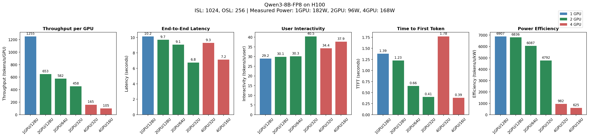

# InferenceX

vLLM Multi-GPU inference benchmarking on [Modal](https://modal.com) cloud infrastructure.

Supports any HuggingFace-compatible model that works with vLLM.

Measures performance across different GPU and concurrent user configurations:
- **Throughput per GPU** (tokens/s/GPU)
- **End-to-End Latency** (seconds)
- **User Interactivity** (tokens/s/user)
- **Time to First Token** (seconds)
- **Power Efficiency** (tokens/s/kW) - from real nvidia-smi measurements

---

## Table of Contents

- [Sample Results](#sample-results)
- [Key Insights](#key-insights)
- [Architecture](#architecture)
- [Option 1: Local Setup](#option-1-local-setup)
- [Option 2: GitHub Actions](#option-2-github-actions)
- [Configuration Examples](#configuration-examples)
- [References](#references)

---

## Sample Results

**Qwen3-8B-FP8 on H100** (ISL: 1024, OSL: 256)



| Config | GPUs | Users | Thru/GPU | Latency | Interactivity | TTFT | Power Eff. |
|--------|------|-------|----------|---------|---------------|------|------------|
| 1GPU/128U | 1 | 128 | 1,255 tok/s | 10.2s | 29.2 tok/s/user | 1.39s | 6,907 tok/s/kW |
| 2GPU/128U | 2 | 128 | 653 tok/s | 9.8s | 30.1 tok/s/user | 1.23s | 6,836 tok/s/kW |
| 2GPU/64U | 2 | 64 | 582 tok/s | 9.1s | 30.3 tok/s/user | 0.66s | 6,087 tok/s/kW |
| 2GPU/32U | 2 | 32 | 458 tok/s | 6.8s | 40.5 tok/s/user | 0.41s | 4,792 tok/s/kW |
| 4GPU/32U | 4 | 32 | 165 tok/s | 9.4s | 34.4 tok/s/user | 1.78s | 982 tok/s/kW |
| 4GPU/16U | 4 | 16 | 105 tok/s | 7.2s | 37.9 tok/s/user | 0.39s | 625 tok/s/kW |

---

## Key Insights

1. **1 GPU / 128 users is optimal for throughput & efficiency**
   - Highest throughput per GPU (1,255 tok/s)
   - Best power efficiency (6,907 tok/s/kW)
   - The 8B model fits entirely on 1 GPU

2. **2 GPU / 32 users is best for user experience**
   - Lowest latency (6.8s)
   - Best interactivity (40.5 tok/s/user)
   - Good balance of throughput and responsiveness

3. **4 GPU configurations are inefficient for 8B models**
   - Tensor parallelism overhead hurts performance
   - Worst power efficiency (625-982 tok/s/kW)
   - Only beneficial for models too large for fewer GPUs

4. **TTFT improves with fewer concurrent users**
   - Less queuing = faster first token
   - 4GPU/16U has best TTFT (0.39s)

---

## Architecture

```
┌─────────────────────────────────────────────────────────────────┐
│                         Modal Cloud                              │
│  ┌─────────────┐  ┌─────────────┐  ┌─────────────┐              │
│  │   1 GPU     │  │   2 GPU     │  │   4 GPU     │              │
│  │  Endpoint   │  │  Endpoint   │  │  Endpoint   │              │
│  │  (vLLM)     │  │  (vLLM TP)  │  │  (vLLM TP)  │              │
│  └─────────────┘  └─────────────┘  └─────────────┘              │
│         │                │                │                      │
│         └────────────────┼────────────────┘                      │
│                          │                                       │
│                 ┌────────▼────────┐                              │
│                 │  Power Monitor  │                              │
│                 │  (nvidia-smi)   │                              │
│                 └────────┬────────┘                              │
│                          │                                       │
│                 ┌────────▼────────┐                              │
│                 │  Modal Volume   │                              │
│                 │  (power logs)   │                              │
│                 └─────────────────┘                              │
└─────────────────────────────────────────────────────────────────┘
                           │
                           ▼
┌─────────────────────────────────────────────────────────────────┐
│                    Local / GitHub Actions                        │
│  ┌─────────────────┐  ┌─────────────────┐  ┌─────────────────┐  │
│  │ benchmark_      │  │ plot_           │  │ Results:        │  │
│  │ gpu_users.py    │──│ gpu_users.py    │──│ - JSON          │  │
│  │ (async HTTP)    │  │ (matplotlib)    │  │ - PNG chart     │  │
│  └─────────────────┘  └─────────────────┘  └─────────────────┘  │
└─────────────────────────────────────────────────────────────────┘
```

### Files

| File | Description |
|------|-------------|
| `vllm_multi_gpu.py` | Modal deployment with 1/2/4 GPU endpoints and nvidia-smi power monitoring |
| `benchmark_gpu_users.py` | Async benchmark script with configurable ISL/OSL |
| `plot_gpu_users.py` | 5-panel chart generator with real power efficiency data |
| `requirements.txt` | Python dependencies |
| `.github/workflows/benchmark.yml` | GitHub Actions workflow for automated benchmarking |
| `setup_and_steps.txt` | Detailed local setup reference |

---

## Option 1: Local Setup

Run benchmarks from your local machine.

### Prerequisites

- Python 3.10+
- A [Modal](https://modal.com) account
- Internet connection

### Step 1: Clone and Create Virtual Environment

```bash
git clone https://github.com/strangeloopio/inferencex.git
cd inferencex

python -m venv venv

# Windows
venv\Scripts\activate

# Linux/Mac
source venv/bin/activate
```

### Step 2: Install Dependencies

```bash
pip install -r requirements.txt
```

**requirements.txt contains:**
```
modal      # Modal cloud platform SDK
aiohttp    # Async HTTP client for benchmarking
matplotlib # Plotting library for charts
```

### Step 3: Authenticate with Modal

```bash
python -m modal setup
```

This opens a browser for authentication and saves your token to `~/.modal.toml`

### Step 4: Deploy Endpoints

```bash
# Default: Qwen3-8B-FP8 on H100
python -m modal deploy vllm_multi_gpu.py
```

This creates three OpenAI-compatible endpoints:
- `https://<workspace>--vllm-multi-gpu-benchmark-serve-1gpu.modal.run`
- `https://<workspace>--vllm-multi-gpu-benchmark-serve-2gpu.modal.run`
- `https://<workspace>--vllm-multi-gpu-benchmark-serve-4gpu.modal.run`

### Step 5: Run Benchmarks

```bash
python benchmark_gpu_users.py \
  --url-1gpu "https://<workspace>--vllm-multi-gpu-benchmark-serve-1gpu.modal.run" \
  --url-2gpu "https://<workspace>--vllm-multi-gpu-benchmark-serve-2gpu.modal.run" \
  --url-4gpu "https://<workspace>--vllm-multi-gpu-benchmark-serve-4gpu.modal.run" \
  --requests 50 \
  --isl 1024 \
  --osl 256
```

Results saved to: `benchmark_gpu_users_results.json`

### Step 6: Download Power Logs

```bash
# List available power logs
python -m modal run vllm_multi_gpu.py --action logs

# Download a specific log
python -m modal run vllm_multi_gpu.py --action "download power_log_1gpu_YYYYMMDD_HHMMSS.csv"
```

### Step 7: Generate Plots

```bash
python plot_gpu_users.py --gpu H100 --model "Qwen3-8B-FP8"
```

Output: `gpu_users_bar_comparison.png` (5-panel chart)

### Step 8: Stop Modal App (Save Costs)

```bash
python -m modal app stop vllm-multi-gpu-benchmark
```

Note: Modal auto-scales down after 15 minutes of inactivity.

### Power Monitoring

Power data is captured automatically via nvidia-smi during inference:
- Logged every 1 second to Modal Volume
- Only readings with GPU utilization > 5% are used for efficiency calculations
- Stored as CSV files: `power_log_{n_gpu}gpu_{timestamp}.csv`

**Power Log Format:**

| Column | Description |
|--------|-------------|
| `timestamp` | ISO format timestamp |
| `gpu_id` | GPU index |
| `power_draw_w` | Power draw in watts |
| `temperature_c` | GPU temperature |
| `gpu_util_pct` | GPU utilization % |
| `mem_util_pct` | Memory utilization % |
| `mem_used_mb` | Memory used in MB |

**Managing Power Logs:**

```bash
# List available power logs
python -m modal run vllm_multi_gpu.py --action logs

# Download a specific log
python -m modal run vllm_multi_gpu.py --action "download power_log_1gpu_YYYYMMDD_HHMMSS.csv"

# Clear all power logs
python -m modal run vllm_multi_gpu.py --action clear
```

### Useful Commands

**Modal Commands:**

```bash
# List Modal apps
python -m modal app list

# View app logs
python -m modal app logs vllm-multi-gpu-benchmark

# Stop app (save costs)
python -m modal app stop vllm-multi-gpu-benchmark

# Redeploy
python -m modal deploy vllm_multi_gpu.py
```

**Plot Commands:**

```bash
# Default plot
python plot_gpu_users.py

# Custom GPU and model name
python plot_gpu_users.py --gpu H200 --model "Llama-3.1-8B"

# Custom paths
python plot_gpu_users.py \
  --results path/to/results.json \
  --power-logs path/to/logs/ \
  --output my_chart.png
```

---

## Option 2: GitHub Actions

Run benchmarks automatically via GitHub Actions (no local setup required after initial configuration).

### Setup (One-Time)

1. **Fork this repository** or use your own copy

2. **Add repository secrets** (Settings > Secrets and variables > Actions > New repository secret):

   | Secret Name | Value | Where to Find |
   |-------------|-------|---------------|
   | `MODAL_TOKEN_ID` | `ak-xxxxx` | `~/.modal.toml` after running `modal setup` locally |
   | `MODAL_TOKEN_SECRET` | `as-xxxxx` | `~/.modal.toml` after running `modal setup` locally |
   | `MODAL_WORKSPACE` | Your workspace name | First part of your Modal app URLs |

### Running Benchmarks

1. Go to **Actions** tab in your repository
2. Select **"vLLM Multi-GPU Benchmark"** workflow
3. Click **"Run workflow"**
4. Configure inputs:

   | Input | Default | Description |
   |-------|---------|-------------|
   | `requests` | 50 | Number of requests per configuration |
   | `isl` | 1024 | Input Sequence Length (tokens) |
   | `osl` | 256 | Output Sequence Length (tokens) |
   | `gpu_type` | H100 | GPU type: H100, H200, or B200 |
   | `model_name` | Qwen/Qwen3-8B-FP8 | HuggingFace model path |

5. Click **"Run workflow"**

### Accessing Results

After the workflow completes:

1. Go to the completed workflow run
2. Scroll down to the **"Artifacts"** section
3. Download `benchmark-results-<run_number>.zip`
4. Extract to get:
   - `gpu_users_bar_comparison.png` - 5-panel comparison chart
   - `benchmark_gpu_users_results.json` - Raw benchmark data
   - `power_log_*.csv` - nvidia-smi power measurements

**Artifacts are retained for 90 days.**

### Workflow Steps (Automated)

The GitHub Actions workflow automatically:
1. Sets up Python and installs dependencies
2. Authenticates with Modal using your secrets
3. Deploys the vLLM endpoints
4. Waits for endpoints to warm up
5. Runs the benchmark suite
6. Downloads power logs from Modal Volume
7. Generates the 5-panel comparison chart
8. **Stops the Modal app** (to save costs)
9. Uploads results as artifacts

### Scheduled Runs (Optional)

To enable automatic weekly benchmarks, uncomment the schedule section in `.github/workflows/benchmark.yml`:

```yaml
schedule:
  - cron: '0 2 * * 0'  # Every Sunday at 2 AM UTC
```

---

## Configuration Examples

### Example 1: Default (Qwen3-8B-FP8 on H100)

**Local:**
```bash
python -m modal deploy vllm_multi_gpu.py
```

**GitHub Actions:** Just use default inputs.

---

### Example 2: Llama 3.1 8B on H200

**Local:**
```bash
MODEL_NAME="meta-llama/Llama-3.1-8B" GPU_TYPE="H200" python -m modal deploy vllm_multi_gpu.py

python benchmark_gpu_users.py \
  --url-1gpu "https://<workspace>--vllm-multi-gpu-benchmark-serve-1gpu.modal.run" \
  --url-2gpu "https://<workspace>--vllm-multi-gpu-benchmark-serve-2gpu.modal.run" \
  --url-4gpu "https://<workspace>--vllm-multi-gpu-benchmark-serve-4gpu.modal.run" \
  --isl 2048 --osl 512

python plot_gpu_users.py --gpu H200 --model "Llama-3.1-8B"
```

**GitHub Actions:** Set inputs when triggering:
- `model_name`: `meta-llama/Llama-3.1-8B`
- `gpu_type`: `H200`
- `isl`: `2048`
- `osl`: `512`

---

### Example 3: Mistral 7B v0.3 on B200 with Long Context

**Local:**
```bash
MODEL_NAME="mistralai/Mistral-7B-v0.3" GPU_TYPE="B200" python -m modal deploy vllm_multi_gpu.py

python benchmark_gpu_users.py \
  --url-1gpu "https://<workspace>--vllm-multi-gpu-benchmark-serve-1gpu.modal.run" \
  --url-2gpu "https://<workspace>--vllm-multi-gpu-benchmark-serve-2gpu.modal.run" \
  --url-4gpu "https://<workspace>--vllm-multi-gpu-benchmark-serve-4gpu.modal.run" \
  --isl 4096 --osl 1024 --requests 30

python plot_gpu_users.py --gpu B200 --model "Mistral-7B-v0.3"
```

**GitHub Actions:** Set inputs when triggering:
- `model_name`: `mistralai/Mistral-7B-v0.3`
- `gpu_type`: `B200`
- `isl`: `4096`
- `osl`: `1024`
- `requests`: `30`

---

### Example 4: Specific Model Revision

**Local:**
```bash
MODEL_NAME="Qwen/Qwen3-8B-FP8" MODEL_REVISION="abc123" python -m modal deploy vllm_multi_gpu.py
```

If `MODEL_REVISION` is not set, the latest version from HuggingFace is used.

---

### Benchmark Parameters Reference

| Parameter | Default | Description |
|-----------|---------|-------------|
| `--requests` | 50 | Number of HTTP requests per GPU/user configuration |
| `--isl` | 1024 | Input Sequence Length in tokens |
| `--osl` | 256 | Output Sequence Length in tokens |

**What these mean:**

- **requests**: How many inference calls to make per configuration. Higher = more statistically reliable results but longer benchmark time. Each configuration (1GPU/128U, 2GPU/64U, etc.) will process this many requests to calculate average metrics.

- **ISL (Input Sequence Length)**: The number of tokens in the input prompt sent to the model. Simulates different use cases - short prompts (chat) vs long prompts (document analysis). The benchmark generates random tokens of this length.

- **OSL (Output Sequence Length)**: The maximum number of tokens the model generates in response. Controls how much text the model produces per request. Longer outputs test sustained generation performance.

**ISL/OSL Examples:**
- `--isl 1024 --osl 256` - Short input, short output (chat)
- `--isl 1024 --osl 1024` - Balanced
- `--isl 4096 --osl 1024` - Long context input (document Q&A)
- `--isl 1024 --osl 4096` - Long generation output (content creation)

### GPU/User Configurations Tested

| Config | GPUs | Concurrent Users |
|--------|------|------------------|
| 1GPU/128U | 1 | 128 |
| 2GPU/128U | 2 | 128 |
| 2GPU/64U | 2 | 64 |
| 2GPU/32U | 2 | 32 |
| 4GPU/32U | 4 | 32 |
| 4GPU/16U | 4 | 16 |

---

## References

- [InferenceMAX Benchmarks](https://inferencemax.semianalysis.com/) - Inspiration for this project
- [Modal Documentation](https://modal.com/docs)
- [Modal vLLM Example](https://modal.com/docs/examples/vllm_inference)
- [Modal CUDA Guide](https://modal.com/docs/guide/cuda)
- [vLLM Documentation](https://docs.vllm.ai/)
- [vLLM Supported Models](https://docs.vllm.ai/en/latest/models/supported_models.html)
- [HuggingFace Models](https://huggingface.co/models)

---

## License

MIT
